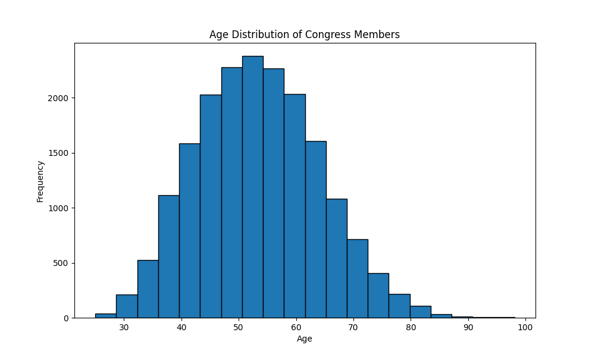

Describe:
shape: (1, 13)
┌──────────┬─────────┬──────────┬───────────┬───┬───────┬───────────┬───────────┬──────┐
│ congress ┆ chamber ┆ bioguide ┆ firstname ┆ … ┆ party ┆ incumbent ┆ termstart ┆ age  │
│ ---      ┆ ---     ┆ ---      ┆ ---       ┆   ┆ ---   ┆ ---       ┆ ---       ┆ ---  │
│ f64      ┆ str     ┆ str      ┆ str       ┆   ┆ str   ┆ str       ┆ str       ┆ f64  │
╞══════════╪═════════╪══════════╪═══════════╪═══╪═══════╪═══════════╪═══════════╪══════╡
│ 96.0     ┆ null    ┆ null     ┆ null      ┆ … ┆ null  ┆ null      ┆ null      ┆ 53.0 │
└──────────┴─────────┴──────────┴───────────┴───┴───────┴───────────┴───────────┴──────┘

Median:
shape: (9, 14)
┌────────────┬───────────┬─────────┬──────────┬───┬───────┬───────────┬────────────┬───────────┐
│ describe   ┆ congress  ┆ chamber ┆ bioguide ┆ … ┆ party ┆ incumbent ┆ termstart  ┆ age       │
│ ---        ┆ ---       ┆ ---     ┆ ---      ┆   ┆ ---   ┆ ---       ┆ ---        ┆ ---       │
│ str        ┆ f64       ┆ str     ┆ str      ┆   ┆ str   ┆ str       ┆ str        ┆ f64       │
╞════════════╪═══════════╪═════════╪══════════╪═══╪═══════╪═══════════╪════════════╪═══════════╡
│ count      ┆ 18635.0   ┆ 18635   ┆ 18635    ┆ … ┆ 18635 ┆ 18635     ┆ 18635      ┆ 18635.0   │
│ null_count ┆ 0.0       ┆ 0       ┆ 0        ┆ … ┆ 0     ┆ 0         ┆ 0          ┆ 0.0       │
│ mean       ┆ 96.445989 ┆ null    ┆ null     ┆ … ┆ null  ┆ null      ┆ null       ┆ 53.313732 │
│ std        ┆ 9.823429  ┆ null    ┆ null     ┆ … ┆ null  ┆ null      ┆ null       ┆ 10.678469 │
│ min        ┆ 80.0      ┆ house   ┆ A000001  ┆ … ┆ AL    ┆ No        ┆ 1947-01-03 ┆ 25.0      │
│ 25%        ┆ 88.0      ┆ null    ┆ null     ┆ … ┆ null  ┆ null      ┆ null       ┆ 45.4      │
│ 50%        ┆ 96.0      ┆ null    ┆ null     ┆ … ┆ null  ┆ null      ┆ null       ┆ 53.0      │
│ 75%        ┆ 105.0     ┆ null    ┆ null     ┆ … ┆ null  ┆ null      ┆ null       ┆ 60.6      │
│ max        ┆ 113.0     ┆ senate  ┆ Z000016  ┆ … ┆ R     ┆ Yes       ┆ 2013-01-03 ┆ 98.1      │
└────────────┴───────────┴─────────┴──────────┴───┴───────┴───────────┴────────────┴───────────┘

